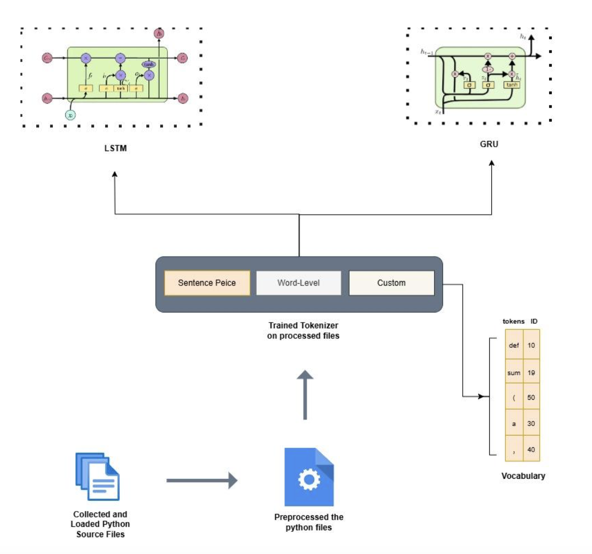
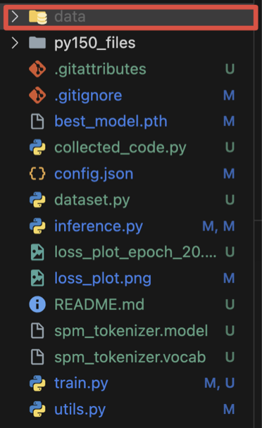

<h1>ML-Based Python Code Autocompletion</h1>

Authors

Zakir Hussain
Nadir Hussain

Course: Machine Learning for Software Analysis

Professor: Fabio Pinelli

Submitted: Feb 14, 2025

## 1. Introduction and Objectives

AutoCode completion is a crucial feature in modern Integrated Development Environments (IDEs), helping developers by predicting and suggesting the next possible tokens as they write code. This project focuses on developing a machine learning-based autocompletion system for Python code. The goal is to predict the next token in a code sequence, similar to how modern IDEs assist developers. In this project, we trained different models using PyTorch and leveraged deep learning techniques such as LSTMs, GRUs, and Transformers.

### Project Objectives:
- To Implement a machine learning model to predict the next token in Python code
- To Train the model using a dataset of Python code snippets
- To Evaluate the model's performance using accuracy, perplexity, and cross-entropy loss
- To Demonstrate inference for autocompletion

## 2. Methodology

### 2.1 Dataset Collection/Adaption
The dataset used for this project is the Py150k dataset, a collection of 150,000 open-source Python source files collected from an online website [1]. Due to limited GPU and memory resources, 500, 1000, and 2000 Python files were selected for different runs, which was further split into 80% for training, and 20% for validation.

### 2.2 Data Preprocessing
The dataset was preprocessed to remove unnecessary elements, such as comments and docstrings, ensuring clean input data for training.

#### Preprocessing Pipeline Steps:

1. **Loading Python Files**: 
   - The dataset consists of raw Python (.py) files stored in a directory
   - A script iterates through the directory structure, loads only valid Python files
   - Reads their content into memory
   - Ensures dataset contains only relevant Python programming code

2. **Cleaning the Code**:
   - Removes comments (e.g., # This is a comment)
   - Removes docstrings (multi-line strings used for documentation)
   - Removes extra newlines and spaces
   - Ensures consistent format for tokenization using the re library
   - In some implementations, dataset was directly fed to tokenizer without pre-processing

3. **Tokenization**:
   The processed dataset is passed through multiple tokenizers in different implementations:

| Tokenizer | # of Source Files | Vocab Size |
|-----------|------------------|------------|
| Word-Level Tokenizer | 1000 | 12847 |
| Sentence Piece Tokenizer | 500 | 130000 |
| Sentence Piece Tokenizer | 100000 | 8000 |
| Custom | 500 | 39901 |

4. **Sequence Generation**:
   - Dataset converted into fixed-length sequences of tokens using trained tokenizer
   - Each sequence consists of L=20, and L=50 consecutive tokens in different runs
   - First L tokens serve as input
   - L+1 token becomes target output (expected next token)
   - Setup allows model to learn contextual relationships between tokens

5. **Dataset Splitting**:
   - Generated sequences divided into 80-20 training and validation sets
   - During inference, code pieces taken from training, validation and unknown sets

## 3. Model Architecture

  
  
<em>Figure 1: Model Architecture showing LSTM and GRU implementations with tokenizer flow</em>

We trained multiple models on varying sets of training data. Specifically, we trained LSTM and GRU models with different strategies for tokenization, hyper-parameters, and varying numbers of epochs.

## 4. Training

The training was carried out on Google Colab and laptop machines. Due to limited resources and the large dataset size, we selected subsets of 500, 1000, or 2000 source files. Training configuration and results:

| Model | Tokenizer | Dataset Size | Epochs | Emb Dim | Hidden Dim | Sequence Length | Accuracy % | Perplexity | Cross-entropy |
|-------|-----------|--------------|---------|----------|-------------|----------------|------------|------------|---------------|
| LSTM | Custom | 500 | 10 | 128 | 256 | 20 | 84.47 | 2.19 | 0.7861 |
| LSTM | Word-Level | 1000 | 15 | 512 | 512 | 50 | 93.33 | 1.42 | 0.35 |
| LSTM | SentencePiece | 500 | 20 | 128 | 256 | 50 | 86.43 | 1.77 | 0.5705 |
| GRU | Word-Level | 1000 | 10 | 512 | 512 | 50 | 93.74 | 1.40 | 0.34 |
| LSTM | SentencePiece | 2000 | 20 | 128 | 256 | 50 | 48.71 | 9.00 | 2.199 |

## 5. Evaluation Results

Our top three models delivered promising results with varying configurations:

1. **Best Performer - GRU with Word-Level tokenizer**:
   - 93.74% accuracy
   - Dataset size: 1000
   - Low perplexity: 1.40
   - Cross-entropy loss: 0.34
   - Only required 10 epochs

2. **Runner-up - LSTM with Word-Level tokenizer**:
   - 93.33% accuracy
   - Dataset size: 1000
   - Required 15 epochs
   - Similar stability metrics

3. **Notable Mention - LSTM with SentencePiece tokenizer**:
   - 86.43% accuracy
   - Smaller dataset: 500 samples
   - 20 epochs training

## 6. Results and Discussion

The experiments show significant insights into different model architectures and tokenization approaches:

- GRU model with Word-Level tokenizer emerged as top performer (93.74% accuracy)
- Word-Level tokenization strategy (vocab size: 12847) proved particularly effective
- 512-dimensional embedding and hidden layers showed optimal results
- Medium-sized datasets with sophisticated tokenization strategies more effective than larger datasets with simpler approaches

## 7. Setup and Execution Instructions
##### Setting up training
We provide different versions of source code in this repo

- SentencePiece500-LSTM
- SentencePiece100K-LSTM
- Custom-LSTM

For Custom-LSTM and SentencePiece100K-LSTM, ensure you have a data folder containing the complete dataset. The dataset can be downloaded from [Py150 Dataset][1].

  
  
<em>Figure 5: Project folder structure showing key files and directories</em>

Some models were trained directly on Google Colab:

https://colab.research.google.com/drive/17OFBm209293CkQC-KswJZO19_CVcIZ0o?usp=sharing

#### Execution/Inference
For testing or execution of trained models:

Open this Google Colab Notebook, Run the cells to load saved models and their configurations

https://colab.research.google.com/drive/1ZfokjtGddSwZSEbt7J-oCqlxsPjjicCC?usp=sharing

## 8. Code Attribution

Parts of code adapted from external sources:
- Custom tokenizer: Built with help from ChatGPT and documentation [2]
- SentencePiece tokenizer: Adapted from Student Presentations, motivated from Original Research paper [3]
- LSTM and GRU architecture: Motivated from course notebooks [4]
- Metric calculations: Adapted with help from ChatGPT

## References

[1]: https://www.sri.inf.ethz.ch/py150
[2]: https://docs.python.org/3/library/re.html#functions 
[3]: https://aclanthology.org/D18-2012.pdf
[4]: https://github.com/fpinell/mlsa/blob/main/notebooks/Lecture_4_Deep_Learning_RNN.ipynb

[Py150 Dataset][1]  
[Python Regular Expressions Documentation][2]  
[SentencePiece Paper][3]  
[Deep Learning RNN Lecture Notebook][4]